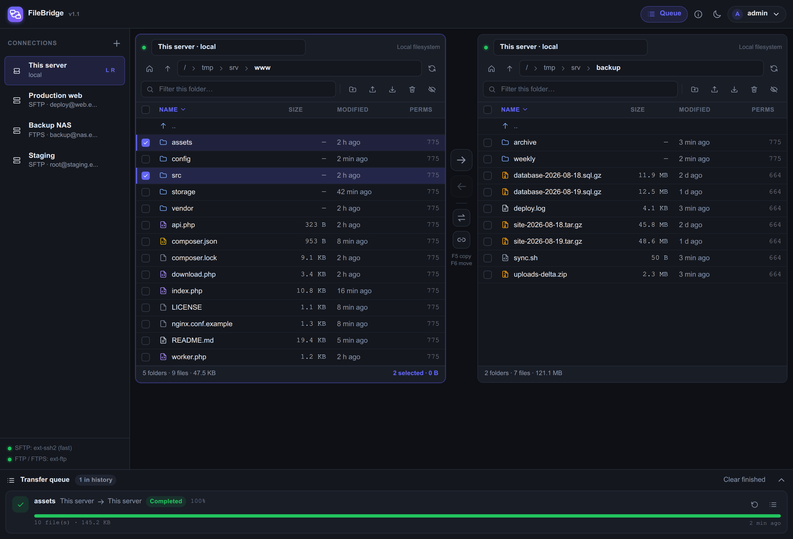
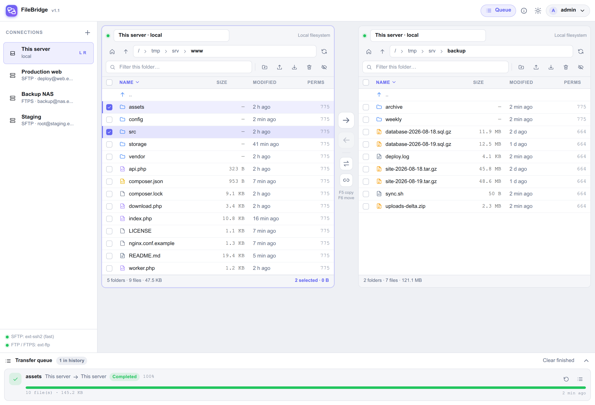

# FileBridge

เครื่องมือคัดลอกไฟล์ **ข้ามเซิร์ฟเวอร์** ผ่านหน้าเว็บแบบสองแผง รองรับ SFTP, FTP, FTPS
และไฟล์ในเครื่อง เขียนด้วย PHP ล้วน + JavaScript และ CSS ธรรมดา ไม่มีเฟรมเวิร์ก
ไม่มีขั้นตอน build ไม่มีการเรียกไฟล์จาก CDN

```
แผงซ้าย (SFTP)  ──อ่านเป็นสตรีม──▶  [ PHP relay ]  ──เขียนเป็นสตรีม──▶  แผงขวา (FTP)
                                  ทีละ 256 KB · บอกความคืบหน้า · หยุดกลางคันได้
```



<details>
<summary>ดูโหมดสว่าง</summary>



</details>

## คุณสมบัติ

- **สองแผงซ้าย–ขวา** แต่ละแผงต่อคนละเซิร์ฟเวอร์ได้อิสระ สลับปลายทางได้ทันที
- **คัดลอก / ย้ายข้ามแผง** ด้วยปุ่ม ◀ ▶ ลากวาง หรือปุ่ม F5 / F6
- **คิวถ่ายโอนเบื้องหลัง** เห็นความคืบหน้า ความเร็ว เวลาที่เหลือ ยกเลิกหรือสั่งใหม่ได้
  และปิดเบราว์เซอร์ทิ้งไว้ได้เพราะงานวิ่งในโพรเซสแยก
- **จัดการไฟล์ครบ** สร้างโฟลเดอร์ เปลี่ยนชื่อ ลบ แก้สิทธิ์ (chmod) อัปโหลด ดาวน์โหลด
  ดาวน์โหลดทั้งโฟลเดอร์เป็น zip และแก้ไขไฟล์ข้อความในตัว
- **ดูรูปในตัว** เปิดรูปจากเซิร์ฟเวอร์ปลายทางได้เลยโดยไม่ต้องดาวน์โหลด ซูม ลากเลื่อน
  และกด ← → เพื่อไล่ดูรูปอื่นในโฟลเดอร์เดียวกัน (jpg, png, gif, webp, avif, bmp, ico, svg)
  ไฟล์ที่ไม่ใช่รูปจะถูก**ข้าม**ตอนไล่ดู และถ้าเปิดไฟล์ที่แสดงไม่ได้ หน้าต่างจะบอกว่า
  ไม่ใช่รูปภาพ ไม่เด้งไปดาวน์โหลดหรือเปลี่ยนหน้าจนหลุดจากการดูรูป
- **นโยบายเมื่อไฟล์ซ้ำ** — เขียนทับ / เฉพาะที่ใหม่กว่า / เก็บทั้งสองไฟล์ / ข้าม
- **ทางลัดเมื่ออยู่เครื่องเดียวกัน** ถ้าทั้งสองแผงชี้ไปที่โฮสต์ SSH เดียวกัน จะสั่ง
  `cp -a` บนเครื่องนั้นแทนการดึงข้อมูลผ่านตัวกลาง
- **คีย์ลัดสไตล์ file manager** ทำงานได้โดยแทบไม่ต้องใช้เมาส์
- **ติดตั้งเป็นแอปได้ (PWA)** ตรึงไว้บนเดสก์ท็อปหรือหน้าจอโฮม เปิดในหน้าต่างของตัวเอง
  ไม่มีแถบที่อยู่ (ต้องเปิดผ่าน HTTPS หรือ localhost)
- **ธีมมืด/สว่าง** และปรับตัวได้บนจอเล็ก
- **ไอคอน SVG ฝังในหน้า** ไม่มี request เพิ่ม ไม่มี icon font

## ความต้องการของระบบ

| รายการ | ใช้ทำอะไร | จำเป็นไหม |
|---|---|---|
| PHP 8.2 ขึ้นไป | ทั้งหมด | ต้องมี |
| `ext-sodium` | เข้ารหัสรหัสผ่านและคีย์ที่เก็บไว้ | ต้องมี |
| `ext-mbstring`, `ext-json` | จัดการข้อความและ API | ต้องมี |
| `phpseclib/phpseclib` | SFTP และการอ่านไฟล์กุญแจ | ติดตั้งผ่าน composer |
| `ext-ftp` | การเชื่อมต่อ FTP และ FTPS | ต้องมีถ้าจะใช้ FTP |
| `ext-zip` | ดาวน์โหลดโฟลเดอร์เป็น zip | ไม่บังคับ |
| `ext-ssh2` | SFTP แบบเร็ว (libssh2) | ไม่บังคับ |

`ext-ssh2` เป็นตัวเลือกเสริม ถ้าไม่มีระบบจะใช้ phpseclib ซึ่งเป็น PHP ล้วนแทนอัตโนมัติ

การเลือก backend ของแต่ละไซต์มีผลกับ**การถ่ายโอนไฟล์**เท่านั้น ส่วน**การอ่านรายการในโฟลเดอร์**
จะใช้ phpseclib เสมอ เพราะ ext-ssh2 ไม่มี API ที่คืนรายละเอียดไฟล์มาพร้อมรายชื่อ จึงต้อง
ถาม stat ทีละไฟล์ (ช้ามากกับเซิร์ฟเวอร์ที่อยู่ไกล) ขณะที่ phpseclib ขอทั้งโฟลเดอร์ได้ในรอบเดียว
ทั้งสองฝั่งจะต่อเชื่อมเมื่อถูกเรียกใช้จริงเท่านั้น การเปิดดูโฟลเดอร์จึงเปิดการเชื่อมต่อเดียว
และการดาวน์โหลดก็เปิดการเชื่อมต่อเดียวเช่นกัน
ถ้ามีจะเร็วขึ้นราว 2–3 เท่า และถ้าติดตั้งไว้แต่ต่อไม่สำเร็จ ระบบจะสลับกลับไปใช้
phpseclib ให้เองโดยผู้ใช้ไม่ต้องทำอะไร

ติดตั้งบน Debian หรือ Ubuntu:

```bash
sudo apt install php-ssh2 php-ftp php-zip
sudo systemctl restart php8.4-fpm
```

## ติดตั้ง

```bash
git clone https://github.com/goragodwiriya/filebridge.git
cd filebridge
composer install --no-dev --optimize-autoloader
```

ชี้เว็บเซิร์ฟเวอร์มาที่โฟลเดอร์นี้แล้วเปิดในเบราว์เซอร์ ครั้งแรกระบบจะให้ตั้งบัญชี
ผู้ดูแลก่อนใช้งาน

ไฟล์สามตัวนี้ถูกสร้างขึ้นเองตอนใช้งานและอยู่ใน `.gitignore` แล้ว **ห้าม commit เด็ดขาด**

| ไฟล์ | เก็บอะไร |
|---|---|
| `config/key.php` | กุญแจหลักที่ใช้ถอดรหัสรหัสผ่านและ private key ทุกอัน — **สำรองไว้ด้วย** |
| `config/users.php` | บัญชีผู้ใช้ (เก็บเป็น bcrypt hash) |
| `config/sites.json` | รายการเซิร์ฟเวอร์ พร้อมความลับที่เข้ารหัสไว้แล้ว |

ถ้ากุญแจหลักหาย จะต้องกรอกรหัสผ่านของทุกเซิร์ฟเวอร์ใหม่ทั้งหมด

## การตั้งค่า

ค่าเริ่มต้นทั้งหมดอยู่ใน [config/config.php](config/config.php) และใช้งานได้ทันทีโดย
ไม่ต้องแก้อะไร ถ้าต้องการเปลี่ยนค่าเฉพาะเครื่องโดยไม่ให้ปนเข้า git ให้สร้าง
`config/config.local.php` แล้วใส่เฉพาะคีย์ที่ต้องการทับ

```php
<?php
return [
    'local_roots'   => ['/var/www', '/srv/backup'],
    'default_theme' => 'light',
];
```

| คีย์ | ความหมาย |
|---|---|
| `local_roots` | โฟลเดอร์ที่การเชื่อมต่อแบบ **Local** เข้าถึงได้ นอกเหนือจากนี้จะถูกปฏิเสธ รวมถึงกรณีที่ symlink ชี้ออกไปข้างนอกด้วย ปล่อยว่างไว้หมายถึงโฟลเดอร์ที่ FileBridge ติดตั้งอยู่ |
| `chunk_size` | ขนาดข้อมูลต่อรอบระหว่างถ่ายโอน ยิ่งใหญ่ยิ่งเสียเวลารอตอบกลับน้อยลง สำคัญมากกับเซิร์ฟเวอร์ที่อยู่ไกล |
| `transfer_workers` | จำนวนไฟล์ที่ถ่ายโอนพร้อมกันต่อหนึ่งงาน ช่วยได้มากเมื่อมีไฟล์เล็กจำนวนมาก ตั้งเป็น `1` ถ้าปลายทางจำกัดจำนวนการเชื่อมต่อ |
| `max_edit_size` | ขนาดไฟล์สูงสุดที่เปิดในตัวแก้ไขข้อความได้ |
| `php_binary` | ที่อยู่ของ PHP CLI สำหรับ worker เบื้องหลัง ปล่อยว่าง = ค้นหาเอง |
| `key_file` | ที่อยู่ของกุญแจหลัก ปล่อยว่าง = `config/key.php` |
| `ip_allowlist` | จำกัดหมายเลข IP ที่เข้าใช้ได้ รองรับทั้ง IP เดี่ยวและช่วงแบบ CIDR ปล่อยว่าง = ไม่จำกัด |
| `verify_host_key` | จำลายนิ้วมือ SSH ครั้งแรกที่เชื่อมต่อ และปฏิเสธถ้าเปลี่ยนไป |
| `login_max_attempts` / `login_lockout` | จำกัดจำนวนครั้งที่ล็อกอินผิด |
| `job_retention` | เก็บประวัติงานที่เสร็จแล้วนานเท่าไร (วินาที) |

### ขนาดไฟล์อัปโหลด

การอัปโหลดจากเบราว์เซอร์ถูกจำกัดด้วยค่าของ PHP เอง ตัวอัปโหลดจะหั่นไฟล์ใหญ่ให้พอดี
กับค่าที่ตั้งไว้อยู่แล้ว แต่ตั้งให้ใหญ่ขึ้นจะลดจำนวนรอบและเร็วกว่า

```ini
upload_max_filesize = 512M
post_max_size = 512M
```

ค่านี้ **ไม่เกี่ยวกับการถ่ายโอนระหว่างเซิร์ฟเวอร์** เพราะข้อมูลไม่ได้ผ่านเบราว์เซอร์

## การติดตั้งให้ปลอดภัย

เครื่องมือนี้เก็บรหัสผ่านของทุกเซิร์ฟเวอร์ที่คุณเพิ่มเข้าไป **ให้เปิดผ่าน HTTPS เสมอ**

Apache จะอ่านไฟล์ `.htaccess` ที่มากับโปรเจ็กต์ได้เอง ส่วน nginx ให้นำกฎจาก
[nginx.conf.example](nginx.conf.example) ไปใส่ในบล็อก `server {}`

```nginx
location ~ ^/(config|storage|src|vendor)/ { deny all; return 404; }
location = /worker.php { deny all; return 404; }
```

### ถ้าโฟลเดอร์โปรเจ็กต์บังคับสิทธิ์ไฟล์ไม่ได้

ระบบไฟล์บางชนิด เช่น NTFS หรือ exFAT ที่เมาท์ผ่าน FUSE จะบังคับให้ทุกไฟล์เป็น `0777`
และไม่สนใจคำสั่ง `chmod` ถ้าโปรเจ็กต์อยู่บนระบบไฟล์แบบนั้น การกันด้วย `.htaccess`
ยังกันทาง HTTP ได้ก็จริง แต่ผู้ใช้อื่นบนเครื่องเดียวกันจะอ่าน `config/key.php` ได้

ทางแก้คือย้ายกุญแจไปไว้บนระบบไฟล์ที่บังคับสิทธิ์ได้จริง

```bash
sudo install -d -m 700 -o www-data -g www-data /etc/filebridge
sudo mv config/key.php /etc/filebridge/key.php
sudo chmod 600 /etc/filebridge/key.php
sudo chown www-data /etc/filebridge/key.php
```

แล้วบอกที่อยู่ใหม่ผ่าน `config/config.local.php`

```php
<?php
return ['key_file' => '/etc/filebridge/key.php'];
```

หรือผ่านตัวแปรสภาพแวดล้อม `FILEBRIDGE_KEY_FILE` (ต้องตั้งให้ทั้ง php-fpm และ CLI
เพราะ worker เบื้องหลังต้องอ่านกุญแจเดียวกัน)

ส่วน private key ของ SSH จะไม่ถูกเขียนลงในโฟลเดอร์โปรเจ็กต์เลย — backend `ext-ssh2`
จำเป็นต้องส่งเป็นไฟล์ให้ libssh2 อ่าน ระบบจึงเขียนลงโฟลเดอร์ temp ของระบบด้วยสิทธิ์
`0600` แล้วเขียนทับด้วยศูนย์และลบทิ้งทันทีที่ยืนยันตัวตนเสร็จ ไม่ว่าจะสำเร็จหรือไม่

### สิ่งที่ระบบทำให้อยู่แล้ว

- รหัสผ่านและ private key ถูกเข้ารหัสด้วย libsodium ก่อนเขียนลงดิสก์ และ **ไม่เคย
  ถูกส่งกลับไปที่เบราว์เซอร์** หน้าเว็บรู้เพียงว่ามีค่าเก็บไว้แล้วหรือยัง
- ทุกคำสั่งที่เปลี่ยนแปลงข้อมูลต้องมี CSRF token
- ลายนิ้วมือ SSH ถูกจำไว้ตั้งแต่การเชื่อมต่อครั้งแรก ถ้าเปลี่ยนไปจะตัดการเชื่อมต่อ
  ทันทีพร้อมแจ้งเตือน
- การลบ เปลี่ยนชื่อ แก้สิทธิ์ อัปโหลด ดาวน์โหลด เปิดดูรูป และถ่ายโอน ถูกบันทึกลง
  `storage/logs/audit-YYYY-MM.log` ทุกครั้ง
- ไฟล์ที่ถูกส่งกลับแบบ **แสดงในหน้า** (`inline`) จำกัดไว้เฉพาะชนิดรูปที่กำหนดไว้
  ตายตัวเท่านั้น พร้อม `nosniff`, CSP `default-src 'none'; sandbox` และแสดงผ่านแท็ก
  `` เสมอ — ไฟล์ SVG ที่ผู้ใช้อัปโหลดจึงรันสคริปต์บนโดเมนเดียวกับเครื่องมือไม่ได้
  ไฟล์ชนิดอื่นยังคงถูกส่งแบบ `attachment` เหมือนเดิม

## โครงสร้างโปรเจ็กต์

```
index.php        โครงหน้าเว็บ ฝัง SVG sprite ไว้ในตัว และประกาศ import map ที่ติด
                 `?v=` ให้ทุกโมดูล — แก้ไฟล์ใน assets/ แล้วให้ขยับ App::VERSION ใน
                 src/App.php ด้วย ไม่งั้นเบราว์เซอร์อาจใช้โมดูลเก่าปนใหม่จนหน้าเว็บว่างเปล่า
api.php          ปลายทาง JSON เพียงจุดเดียว (action → src/Http/Api.php)
download.php     สตรีมไฟล์เดี่ยว หรือบีบเป็น zip สำหรับหลายไฟล์
                 (`?inline=1` = ส่งให้แสดงในหน้า ใช้กับตัวดูรูป)
worker.php       ตัวรันงานถ่ายโอนเบื้องหลัง (CLI)
manifest.php     web app manifest — ชื่อ ไอคอน สี สำหรับตอนติดตั้งเป็นแอป
sw.php           service worker (สร้างด้วย PHP) แคชเฉพาะโครงหน้าเว็บ
offline.html     หน้าที่แสดงเมื่อเปิดแอปแล้วต่อเซิร์ฟเวอร์ไม่ได้

src/Fs/          DriverInterface พร้อม LocalDriver, FtpDriver,
                 SftpSsh2Driver, SftpSeclibDriver, FallbackDriver
src/Transfer/    Job, JobStore, TransferManager, ProgressFilter
src/Security/    Auth, Csrf, Crypto, RateLimit, HostKeyStore
src/Site/        โปรไฟล์การเชื่อมต่อ พร้อมการเข้ารหัสความลับ
src/Http/        Request, Response, Api
assets/          tokens.css + components.css + layout.css และ ES modules
assets/icons/    sprite.svg (ฝังในหน้า) + ไอคอนแอปสำหรับติดตั้ง (svg และ png)
storage/         session, สถานะงาน, log, ไฟล์พัก — ห้ามเปิดให้เข้าถึงผ่านเว็บ
```

ทุกโปรโตคอลถูกห่อด้วย `DriverInterface` ตัวเดียวกัน หน้าเว็บและเอนจินถ่ายโอนจึงไม่
รู้เลยว่าเบื้องหลังแต่ละแผงเป็นโปรโตคอลอะไร การเพิ่ม WebDAV หรือ S3 ในอนาคตจึงเท่ากับ
การเขียนคลาสเพิ่มหนึ่งคลาส

### การถ่ายโอนทำงานอย่างไร

1. เบราว์เซอร์เรียก `transfer.enqueue` ระบบเขียนงานลง `storage/jobs/<id>.json`
2. `TransferManager::spawn()` แยกโพรเซส `php worker.php <id>` ออกไปทำงานต่างหาก
3. worker เปิดการเชื่อมต่อทั้งสองฝั่งครั้งเดียว ไล่รายการไฟล์ทั้งหมดให้เป็นแผนแบน ๆ
   ก่อน แล้วจึงคัดลอกทีละไฟล์แบบสตรีม โดยมี stream filter คอยนับไบต์ที่ไหลผ่าน
   ความคืบหน้าจึงเป็นค่าจริง และการสั่งยกเลิกมีผลทันทีแม้อยู่กลางไฟล์ใหญ่
4. หน้าเว็บถามความคืบหน้าทุก 800 มิลลิวินาทีขณะมีงานวิ่งอยู่

ถ้าเซิร์ฟเวอร์ปิด `proc_open` จนแยกโพรเซสไม่ได้ หน้าเว็บจะเรียก `transfer.run` แทน
แล้วงานจะวิ่งอยู่ใน request นั้น ใช้เอนจินและไฟล์ความคืบหน้าชุดเดียวกัน

## คีย์ลัด

| ปุ่ม | การทำงาน | ปุ่ม | การทำงาน |
|---|---|---|---|
| `Tab` | สลับแผง | `F5` | คัดลอกไปอีกแผง |
| `Enter` | เปิดโฟลเดอร์ / เปิดไฟล์ | `F6` | ย้ายไปอีกแผง |
| `Backspace` | ขึ้นหนึ่งระดับ | `F7` | สร้างโฟลเดอร์ |
| `Space` | เลือก/ยกเลิกแถวที่เคอร์เซอร์อยู่ | `F8` หรือ `Delete` | ลบ |
| `↑` `↓` | เลื่อนเคอร์เซอร์ | `F2` | เปลี่ยนชื่อ |
| `F3` | เปิดดูโดยไม่ออกจากหน้า | `F4` | แก้ไขเป็นข้อความ |
| `Ctrl` + `A` | เลือกทั้งหมด | `Ctrl` + `R` | โหลดใหม่ |
| `Ctrl` + `F` | ไปที่ช่องกรอง | `Ctrl` + `D` | ดาวน์โหลด |
| `Ctrl` + `H` | สลับแสดงไฟล์ซ่อน | `?` | ดูคีย์ลัดทั้งหมด |

`F3` เลือกวิธีเปิดให้เหมาะกับไฟล์เอง — รูปเปิดในหน้าต่างดูรูป ไฟล์ข้อความเปิดในตัวแก้ไข
ส่วนไฟล์อื่นเปิดหน้าต่างดูรูปพร้อมข้อความว่าไม่ใช่รูปภาพ ไม่มีการดาวน์โหลดแทรกขึ้นมาเอง

ในหน้าต่างดูรูป: `←` `→` เปลี่ยนรูป (ข้ามไฟล์ที่ไม่ใช่รูป) · `+` `−` หรือ `Ctrl` + ล้อเมาส์ ซูม ·
`0` ขนาดจริง · `F` พอดีหน้าต่าง · ลากเพื่อเลื่อนภาพเมื่อซูมอยู่ · ดับเบิลคลิกสลับพอดีหน้าต่าง/ขนาดจริง

## ตรึงไว้บนเดสก์ท็อปเหมือนแอป (PWA)

FileBridge ประกาศตัวเป็น Progressive Web App จึงติดตั้งลงเดสก์ท็อปหรือหน้าจอโฮมของมือถือได้
ตัวแอปจะเปิดในหน้าต่างของตัวเอง ไม่มีแถบที่อยู่ ไม่มีแท็บอื่นมาปน มีไอคอนใน launcher/taskbar
เหมือนโปรแกรมทั่วไป และคลิกไอคอนซ้ำจะกลับไปที่หน้าต่างเดิมแทนการเปิดใหม่

> **ต้องเปิดผ่าน HTTPS** (หรือ `http://localhost`) เท่านั้น เบราว์เซอร์ไม่ยอมติดตั้งเว็บที่วิ่งบน
> http ธรรมดา ถ้าเข้าผ่าน IP ในวงแลนแบบ http ปุ่มติดตั้งจะไม่ขึ้นและ service worker จะไม่ทำงาน

### วิธีติดตั้ง

| เบราว์เซอร์ | วิธี |
|---|---|
| Chrome / Edge / Brave (เดสก์ท็อป) | กดปุ่มติดตั้งบนแถบบนของ FileBridge หรือไอคอนติดตั้งท้ายช่องที่อยู่ |
| Chrome (Android) | เมนู ⋮ → “ติดตั้งแอป” |
| Safari (iOS / iPadOS) | ปุ่มแชร์ → “เพิ่มไปยังหน้าจอโฮม” |
| Safari (macOS 14+) | เมนู File → “Add to Dock” |
| Firefox | ยังไม่รองรับการติดตั้งบนเดสก์ท็อป ใช้ผ่านแท็บได้ตามปกติ |

ปุ่มติดตั้งบนแถบบนจะโผล่มาเองเมื่อเบราว์เซอร์แจ้งว่าติดตั้งได้ และหายไปเมื่อติดตั้งแล้ว
(เบราว์เซอร์ที่ไม่มีกลไกนี้ เช่น Safari ปุ่มจะไม่ขึ้น ให้ใช้เมนูของเบราว์เซอร์ตามตาราง)

### สิ่งที่ถูกแคชและไม่ถูกแคช

`sw.php` เก็บเฉพาะ**โครงหน้าเว็บ** — CSS, โมดูล JS และ `offline.html` — ไว้ในแคชชื่อ
`filebridge-<เวอร์ชัน>` ส่วน `api.php` และ `download.php` **ไม่ถูกแคชเลย** รายชื่อไฟล์
เนื้อไฟล์ และทุกอย่างที่ต้องยืนยันตัวตนจึงไม่ตกค้างอยู่บนเครื่องผู้ใช้

ตัวแอปทำงานจริงบนเซิร์ฟเวอร์ จึงใช้งานออฟไลน์ไม่ได้โดยธรรมชาติ เมื่อไม่มีเส้นทางไปถึง
เซิร์ฟเวอร์ การเปิดแอปจะได้หน้า “No connection to the server” พร้อมปุ่มลองใหม่
แทนหน้า error ดิบ ๆ ของเบราว์เซอร์

เวอร์ชันของแคชผูกกับ `App::VERSION` ใน `src/App.php` ขยับเลขนี้ทุกครั้งที่แก้ไฟล์ใน
`assets/` แล้ว `index.php`, `manifest.php` และ `sw.php` จะเปลี่ยนตามพร้อมกัน
แคชของเวอร์ชันเก่าถูกลบทิ้งเองตอน service worker ตัวใหม่เริ่มทำงาน

### เปลี่ยนชื่อและไอคอนของแอป

ชื่อที่แสดงใต้ไอคอนมาจาก `app_name` ใน `config/config.php` ส่วนไอคอนต้นฉบับคือ
`assets/icons/app-icon.svg` (แบบมีขอบมน) และ `app-icon-maskable.svg` (เต็มพื้นที่
สำหรับ Android) แก้แล้วสร้าง PNG ใหม่ด้วย

```bash
cd assets/icons
inkscape app-icon.svg          -w 192 -h 192 -o icon-192.png
inkscape app-icon.svg          -w 512 -h 512 -o icon-512.png
inkscape app-icon-maskable.svg -w 512 -h 512 -o icon-maskable-512.png
inkscape app-icon-maskable.svg -w 180 -h 180 -o apple-touch-icon.png
```

จากนั้นขยับ `App::VERSION` เพื่อให้เบราว์เซอร์ดึงไอคอนชุดใหม่

## การดูแลรักษา

งานที่เสร็จแล้วจะถูกล้างอัตโนมัติทุกครั้งที่เปิดดูคิว ถ้าต้องการให้เก็บกวาดแม้ไม่มี
ใครเปิดหน้าเว็บ ให้ตั้ง cron

```cron
17 4 * * * /usr/bin/php /path/to/filebridge/worker.php --prune >/dev/null 2>&1
```

## แก้ปัญหา

| อาการ | สาเหตุและทางแก้ |
|---|---|
| งานค้างสถานะ *queued* | แยกโพรเซส worker ไม่สำเร็จ หน้าเว็บจะรันให้ผ่าน HTTP เองหลังผ่านไป 8 วินาที แก้ถาวรด้วยการตั้ง `php_binary` ให้ชี้ไปที่ PHP CLI |
| *HOST KEY CHANGED* | ลายนิ้วมือ SSH ไม่ตรงกับที่จำไว้ ถ้าเป็นการเปลี่ยนที่ตั้งใจ ให้ลบรายการนั้นออกจาก `storage/known_hosts.json` |
| *That key is a public key* | วางไฟล์ `.pub` ผิดตัว ให้ใช้ไฟล์ที่ไม่มีนามสกุล `.pub` |
| FTP เปิดโฟลเดอร์แล้วว่างทั้งที่มีไฟล์ | เซิร์ฟเวอร์ไม่รับ passive mode ให้ปิดตัวเลือก passive ในหน้าแก้ไขการเชื่อมต่อ |
| *SITE CHMOD unsupported* | เซิร์ฟเวอร์ FTP หลายตัวไม่รองรับการแก้สิทธิ์ ส่วน SFTP รองรับเสมอ |
| อัปโหลดไฟล์ใหญ่ไม่ผ่าน | เพิ่มค่า `upload_max_filesize` และ `post_max_size` |
| เชื่อมต่อ SFTP ช้า | ติดตั้ง `ext-ssh2` เพิ่ม ระบบจะเปลี่ยนไปใช้เองอัตโนมัติ |
| ปุ่มติดตั้งแอปไม่ขึ้น | เปิดผ่าน http ธรรมดา ต้องใช้ HTTPS หรือ `http://localhost` (บน Safari และ Firefox ปุ่มนี้ไม่มีอยู่แล้ว ให้ใช้เมนูของเบราว์เซอร์) |
| แก้ไฟล์ใน `assets/` แล้วหน้าเว็บยังเป็นของเก่า | service worker เสิร์ฟของเดิมอยู่ ให้ขยับ `App::VERSION` ใน `src/App.php` แล้วโหลดหน้าใหม่ |

## สัญญาอนุญาต

เผยแพร่ภายใต้สัญญาอนุญาต MIT ดูรายละเอียดใน [LICENSE](LICENSE)
